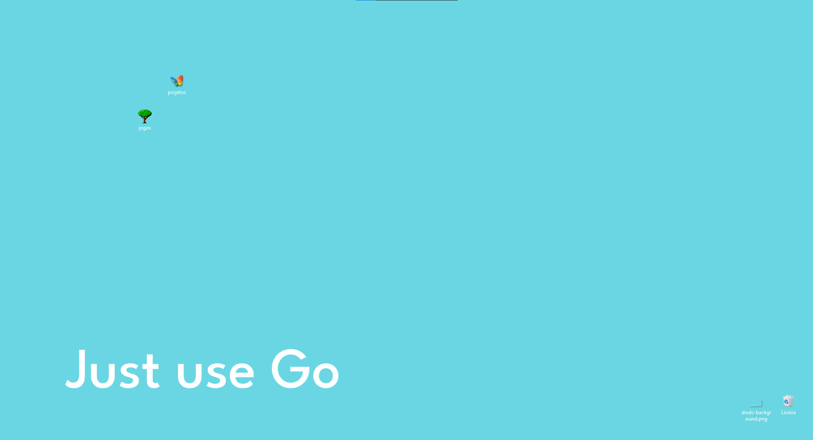
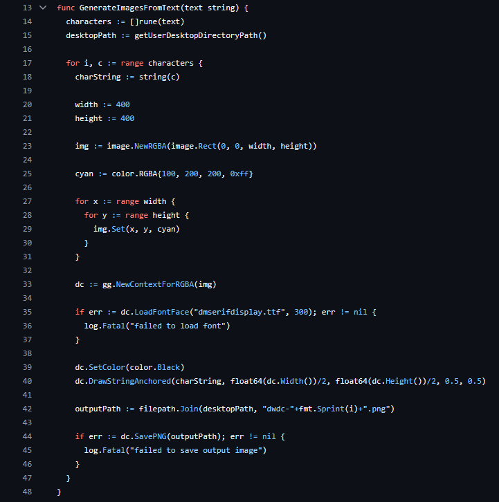

# dwdc

`dwdc` stands for Desktop Widget [to] Display Characters.




## Features

dwdc aims to just **generate images that form some text**.

- Want to set font family, background and foreground colors? Possible
- Want some aesthetic static phrase? Possible
- Want some dynamic text? Possible but limited, [see at the bottom of this section](#settings)
- Want a single big picture of some cool text? Possible

The idea is to make the binary `dwdc` generates images when invoked without arguments, and also let user defines the settings through a CLI (`dwdc [...]`). NOT POSSIBLE YET.

> [!IMPORTANT]
> A pitfall that I came across is that the generated images cannot be positioned horizontally (like letters in a word) by dwdc, therefore it's user's job to fix them. The good side is that once in the right place the next generated images will be in the right spot too. This take is true for Windows 10 (it may not in other OS), and for images with the same name, so don't change the images' name,

## Installation

Sadly, there are no binaries for other OS besides Windows yet.

1. Go to the [latest release page](https://github.com/kauefraga/dwdc/releases/latest)
2. Download the required files (`dwdc.exe`, `leaguespartan.ttf`, etc.)
3. Put them in the same folder

That's it! **You can run `dwdc.exe` and look at your desktop area**.

But I suggest you to keep reading this documentation, the next section covers customization... probably why you got here in the first place, isn't it?

## Usage

After [installation](#installation), the default settings is going to

```
- Look for `dwdc-*.png` images in your desktop area
- Remove them
- Get current day of the week in Brazilian Portuguese (e.g. Sunday -> Domingo)
- Generate 7 images (if "Domingo") in your desktop area, each containing a letter of "Domingo"
```

That's why `dwdc` was made for, originally.

However, writing this beautiful piece of software and not using it for whatever text whoever wants it to display is such a waste of potential.



I adapted it a little bit and because of this, you can customize your dwdc using [TOML](https://toml.io/en/).

First, create a `dwdc.toml` file in the same folder as the dwdc binary, and keep along.

### Settings

The simplest example: set the background color and foreground color.

```toml
BackgroundColor = [255, 214, 10, 255]
Color = [0, 29, 61, 255]
```

Yes, it looks like CSS properties. The colors are in the [RGBA format](https://rgbacolorpicker.com/). Note that the alpha channel (last element) is from 0 to 255 too.

#### Full specification:

```toml
# [array of 4 uint8 (0 to 255)]
# Color used to fill the background of each image
BackgroundColor = [100, 200, 200, 255]

# [array of 4 uint8 (0 to 255)]
# Color used to fill the foreground/characters
Color = [0, 0, 0, 0]

# [string]
# Pattern used to generate the image
# static templates available: text, backgroundimage
# Dynamic templates available: dayoftheweek (dynamic) (unavailable but planned: today's weather, day of the month, someone's github commit count)
Template = "dayoftheweek"

# [string]
# Static text to be displayed
Text = ""

# [string]
# Text position is used when the "backgroundimage" template is set to define where the text will be
# positions available: topleft, topcenter, topright, centerleft, center, centerright, bottomleft, bottomcenter, bottomright
TextPosition = "center"

# [string]
# Path to font file relative to dwdc binary 
FontFamily = "dmserifdisplay.ttf"

# [uint]
# Text setting font size
FontSize = 250
```

#### Make it really dynamic

Create a basic task in Windows Task Scheduler to start dwdc everytime your computer boots up. This way, it will remain synchronized with the current day. 

#### Examples

Soon.

## History

I was wondering if I can make something like the rainmeter (image below) myself, and just thought about creating images containing characters that form the day of the week using the image miniatures that the operational system generates.


Choose Go because it easily compiles to a binary that I can set to be a startup app, then it would run everytime I turn on my computer, keeping the current day in sync.

## License

This project is licensed under the MIT License - See the [LICENSE](https://github.com/kauefraga/dwdc/blob/main/LICENSE) for more information.