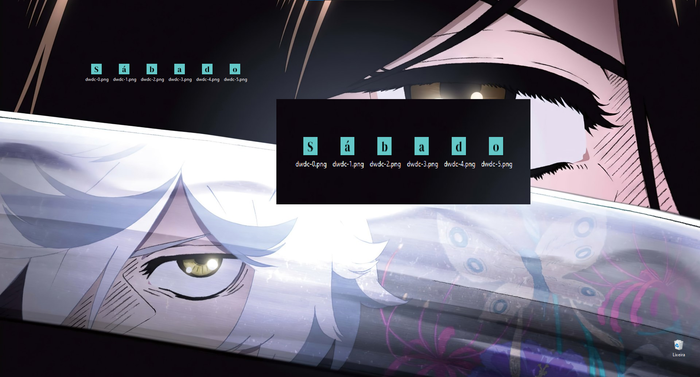
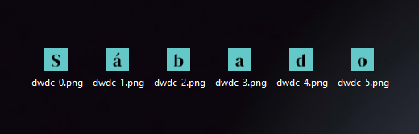

# dwdc

`dwdc` stands for Desktop Widget [to] Display Characters.

> [!NOTE]
> It's a work in progress. Below is a list of what to expect for v1.0.0. You can try [v1.0.0-beta](https://github.com/kauefraga/dwdc/releases/tag/v1.0.0-beta) anyway, the release contains its own guide.

## Features

dwdc aims to just **generate images that form some text**.

- Want some aesthetic static phrase? Possible
- Want to set font family, background and foreground colors? Possible
- Want some dynamic text? Possible

The idea is to make the binary `dwdc` generates images when invoked without arguments, and also let user defines the settings through a CLI (`dwdc [...]`). 

> [!IMPORTANT]
> A pitfall that I came across is that the generated images cannot be positioned horizontally (like letters in a word) by dwdc, therefore it's user's job to fix them. The good side is that once in the right place the next generated images will be in the right spot too. This take is true for Windows 10 (it may not in other OS) and for images with the same name.

## Installation

It will be a script like `curl github.com/.../v1.0.0/dwdc.exe` to quickly install it from your terminal.

## Usage

Soon...

## History

I was wondering if I can make something like the rainmeter (image below) myself, and just thought about creating images containing characters that form the day of the week using the image miniatures that the operational system generates.

Choose Go because it easily compiles to a binary that I can set to be a startup app, then it would run everytime I turn on my computer.

## License

This project is licensed under the MIT License - See the [LICENSE](https://github.com/kauefraga/dwdc/blob/main/LICENSE) for more information.