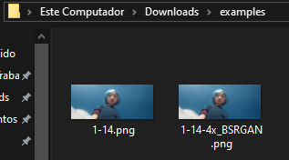

# dwdc

`dwdc` stands for Desktop Widget [to] Display Characters.

[Getting started](#getting-started) •
[Installation](#installation) •
[Settings](#settings) •
[Examples](#examples) •
[Contributing](#contributing)


## Getting started

dwdc has two use cases: **generate images that form some text** (first image) and **generate a background image for your desktop** (second image).

Before executing dwdc you can configure these things:

- Text (obviously, you choose what to display)
- Background and foreground colors
- Font family and font size
- Template

You may be thinking, what is a template and how to generate a single image (for wallpaper usage)?

First things first, a template is a string (like `"dayoftheweek"`, actually, [I mage dwdc for this very use case](#history)) you will set in the dwdc settings file that defines what algorithm to use, so that it dynamically chooses what to display in the generated images.

> [!IMPORTANT]
> A pitfall that I came across is that the generated images cannot be positioned horizontally (like letters in a word) by dwdc, therefore it's user's job to fix them. The good side is that once in the right place the next generated images will be in the right spot. This take is true for Windows 10 (it may not in other OS), and for images with the same name, so don't change the images' name.

## Installation

Sadly, there are no binaries for other OS besides Windows yet, [want to contribute](#contributing)?

1. Go to the [latest release page](https://github.com/kauefraga/dwdc/releases/latest)
2. Download the required files (`dwdc.exe`, `leaguespartan.ttf`, etc.)
3. Put them in the same folder

That's it! **You can run `dwdc.exe` and look at your desktop area**.

But I suggest you to keep reading this documentation, the next section covers customization... probably why you got here in the first place, isn't it?

## Usage

After [installation](#installation), the default settings is going to

```
- Look for `dwdc-*.png` images in your desktop area
- Remove them
- Get current day of the week in Brazilian Portuguese (e.g. Sunday -> Domingo)
- Generate 7 images (if "Domingo") in your desktop area, each containing a letter of "Domingo"
```

That's why `dwdc` was made for, originally.

However, writing this beautiful piece of software and not using it for whatever text whoever wants it to display is such a waste of potential.


I adapted it a little bit and because of this, you can customize your dwdc using [TOML](https://toml.io/en/).

First, create a `dwdc.toml` file in the same folder as the dwdc binary, and keep along.

### Settings

The simplest example: set the background color and foreground color.

```toml
BackgroundColor = [255, 214, 10, 255]
Color = [0, 29, 61, 255]
```

Yes, it looks like CSS properties. The colors are in the [RGBA format](https://rgbacolorpicker.com/). Note that the alpha channel (last element) is from 0 to 255 too.

#### Full specification:

```toml
# [array of 4 uint8 (0 to 255)]
# Color used to fill the background of each image
BackgroundColor = [100, 200, 200, 255]

# [array of 4 uint8 (0 to 255)]
# Color used to fill the foreground/characters
Color = [0, 0, 0, 0]

# [string]
# Pattern used to generate the image
# static templates available: text, backgroundimage
# Dynamic templates available: dayoftheweek (dynamic) (unavailable but planned: today's weather, day of the month, someone's github commit count)
Template = "dayoftheweek"

# [string]
# Static text to be displayed
Text = ""

# [string]
# Text position is used when the "backgroundimage" template is set to define where the text will be
# positions available: topleft, topcenter, topright, centerleft, center, centerright, bottomleft, bottomcenter, bottomright
TextPosition = "center"

# [string]
# Path to font file relative to dwdc binary 
FontFamily = "dmserifdisplay.ttf"

# [uint]
# Text setting font size
FontSize = 250
```

#### Make it really dynamic

Create a basic task in Windows Task Scheduler to start dwdc everytime your computer boots up. This way, it will remain synchronized with the current day. 

## Examples

Soon.

## Contributing

### What can I do

- Use dwdc, take a screenshot of your result and open a pull request updating the [examples section](#examples) with your screenshot, what you generated (above and in the image's alt text) and what settings you used
- Create a pipeline to automatically build dwdc artifacts to the main platforms (windows, linux and darwin) using GitHub Actions
- Implement a CLI that
    - generates images (default behavior) when `dwdc`, `dwdc gen` or `dwdc generate` is invoked
    - parses flags that override settings in `dwdc.toml`
    - exposes a command (maybe `dwdc init` and `dwdc set [setting] [value]`) to create `dwdc.toml` and help user understand its capabilities 

### How to contribute

Feel free to contribute [opening an issue](https://github.com/kauefraga/dwdc/issues/new) to report a bug or suggesting a CLI change, an improvement or a feature.

1. Fork this project
2. Clone your fork on your machine
3. Setup the [dev environment](#how-to-setup-dev-environment)
4. Make your changes and commit them following [conventional commits](https://www.conventionalcommits.org/en/v1.0.0/)
5. Run `git push` to sync the changes
6. Open a pull request specifying what you did

### How to setup dev environment

- Have [Go](https://go.dev/) installed (Preferably [1.25.6](go.mod))

Install the dependencies

```sh
go mod download
```

And/or just run the project

```sh
go run cmd/main.go
```

## How to build

With [Go](https://go.dev/) installed, building dwdc should be as easy as running the following command

```sh
go build main.go -o dwdc
```

However, running the command below should generate a more lightweight binary

```sh
go build -ldflags=-w -ldflags=-s -o dwdc.exe main.go
```

## History

I was wondering if I can make something like the rainmeter (image below) myself to show the current day of the week, and just thought about generating images containing characters that form the word I need using the image miniatures that the operating system renders.

The most essential concept of dwdc, image miniatures:



This is what a [Rainmeter](https://www.rainmeter.net/) widget looks like:


Choose Go because it easily compiles to a binary that I can set to be a startup app, so it runs every time I boot my computer, looking for the current day of the week and generating the images in my desktop area.

## License

This project is licensed under the MIT License - See the [LICENSE](https://github.com/kauefraga/dwdc/blob/main/LICENSE) for more information.